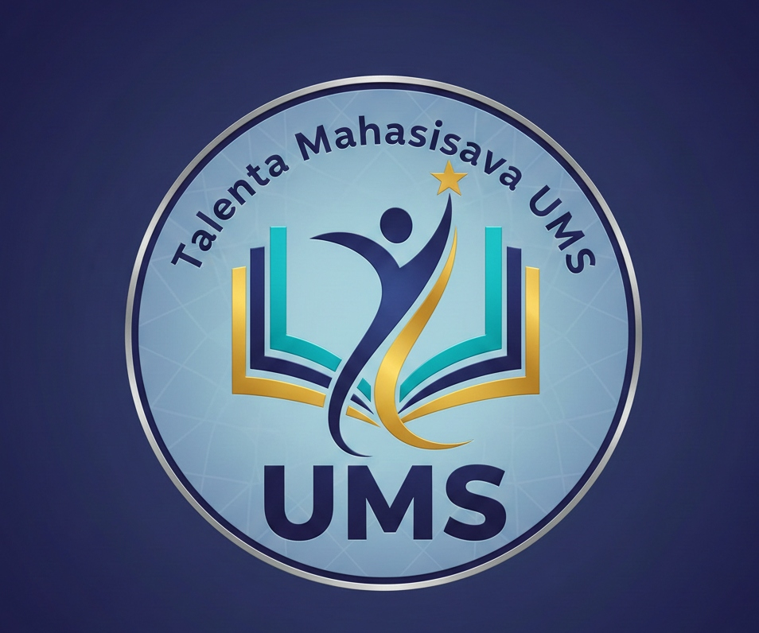

# 🎓 TalentaUMS - Portal Talenta Mahasiswa Universitas Muhammadiyah Surakarta



Platform berbasis web untuk mengelola dan mengeksplorasi talenta mahasiswa Universitas Muhammadiyah Surakarta. Memudahkan mahasiswa untuk menampilkan profil, skills, pengalaman, dan CV mereka kepada publik.

[](http://localhost:5173)
[](http://localhost:8000)
[](http://localhost:5173)

---

## ✨ Features

### 👨‍🎓 Untuk Mahasiswa

- ✅ **Manajemen Profil** - Kelola biodata, foto, dan informasi kontak
- ✅ **Skills Management** - Tambah dan kelola skills dengan level proficiency
- ✅ **Experience Tracking** - Catat pengalaman kerja dan organisasi
- ✅ **CV Download** - Download CV dalam format PDF
- ✅ **Profile Preview** - Lihat preview profil publik
- ✅ **Dark/Light Mode** - Tema yang dapat disesuaikan

### 👔 Untuk Admin

- ✅ **Dashboard Analytics** - Statistik talenta dengan visualisasi modern
- ✅ **User Management** - Kelola akun mahasiswa
- ✅ **Profile Moderation** - Aktifkan/nonaktifkan profil mahasiswa
- ✅ **Advanced Filters** - Filter berdasarkan prodi, skills, dan status
- ✅ **Export Data** - Export data talenta

### 🌐 Untuk Pengunjung Publik

- ✅ **Browse Talents** - Jelajahi daftar talenta mahasiswa
- ✅ **Advanced Search** - Cari berdasarkan nama, skills, atau prodi
- ✅ **Filter Pills** - Filter interaktif dengan UI modern
- ✅ **Talent Details** - Lihat profil lengkap mahasiswa
- ✅ **Contact Info** - Hubungi mahasiswa via email/social media

---

## 🛠️ Tech Stack

### Backend

- **Framework:** Django 5.1.4 + Django REST Framework 3.15.2
- **Database:** PostgreSQL
- **Authentication:** JWT (djangorestframework-simplejwt)
- **CORS:** django-cors-headers
- **File Upload:** Pillow for image processing

### Frontend

- **Framework:** React 18.3.1 + TypeScript
- **Build Tool:** Vite 6.0.5
- **Routing:** React Router DOM 7.1.1
- **State Management:** Zustand 5.0.2
- **Styling:** Tailwind CSS 3.4.17
- **Icons:** Lucide React 0.469.0
- **HTTP Client:** Axios 1.7.9

### DevOps

- **Containerization:** Docker + Docker Compose
- **Version Control:** Git + GitHub

---

## 🚀 Quick Start

### Prerequisites

- Docker & Docker Compose
- Git

### Installation

1. **Clone Repository**

   ```bash
   git clone https://github.com/afrizalfikrii/aplikasi-talenta-mahasiswa-UMS.git
   cd aplikasi-talenta-mahasiswa-UMS
   ```

2. **Setup Environment Variables**

   ```bash
   # Backend
   cp backend/.env.example backend/.env
   # Edit backend/.env dengan konfigurasi Anda
   ```

3. **Run with Docker**

   ```bash
   docker-compose up -d
   ```

4. **Run Migrations**

   ```bash
   docker-compose exec backend python manage.py migrate
   ```

5. **Create Superuser**

   ```bash
   docker-compose exec backend python manage.py createsuperuser
   ```

6. **Access Application**
   - Frontend: http://localhost:5173
   - Backend API: http://localhost:8000
   - Admin Panel: http://localhost:8000/admin

---

## 📁 Project Structure

```
aplikasi-talenta-mahasiswa-ums/
├── backend/                 # Django REST Framework
│   ├── authentication/      # User authentication & JWT
│   ├── talents/            # Talent profiles, skills, experience
│   ├── config/             # Django settings
│   └── manage.py
├── frontend/               # React + Vite
│   ├── src/
│   │   ├── components/     # Reusable components
│   │   ├── features/       # Feature modules
│   │   │   ├── admin/      # Admin dashboard
│   │   │   ├── auth/       # Authentication
│   │   │   └── talents/    # Talent features
│   │   ├── assets/         # Images, logos
│   │   └── app/            # App configuration
│   └── package.json
├── docker-compose.yml      # Docker orchestration
└── README.md
```

---

## 📸 Screenshots

### Homepage

Modern landing page dengan daftar talenta terbaru dan statistik.

### Admin Dashboard

Dashboard dengan gradient stats cards, modern table, dan advanced filters.

### Talent Profile

Profil lengkap mahasiswa dengan skills, experience, dan contact info.

---

## 🎨 UI/UX Highlights

- ✨ **Modern Design** - Glass morphism, gradients, smooth animations
- 🌙 **Dark Mode** - Full dark mode support
- 📱 **Responsive** - Mobile-first design
- ⚡ **Fast** - Optimized performance with Vite
- 🎯 **Intuitive** - User-friendly navigation and interactions

---

## 📚 Documentation

- [API Documentation](DOKUMENTASI_API.md)
- [Project Documentation](DOKUMENTASI_PROYEK.md)
- [English README](README_EN.md)

---

## 🤝 Contributing

Contributions are welcome! Please feel free to submit a Pull Request.

1. Fork the project
2. Create your feature branch (`git checkout -b feature/AmazingFeature`)
3. Commit your changes (`git commit -m 'Add some AmazingFeature'`)
4. Push to the branch (`git push origin feature/AmazingFeature`)
5. Open a Pull Request

---

## 📝 License

This project is licensed under the MIT License.

---

## 👥 Team

Developed by students of Universitas Muhammadiyah Surakarta as part of Web Programming Framework course (TIF 1336).

---

## 📞 Contact

For questions or support, please contact:

- **Email:** talentaums@example.com
- **Website:** [TalentaUMS](http://localhost:5173)

---

**Made with ❤️ by UMS Students**
